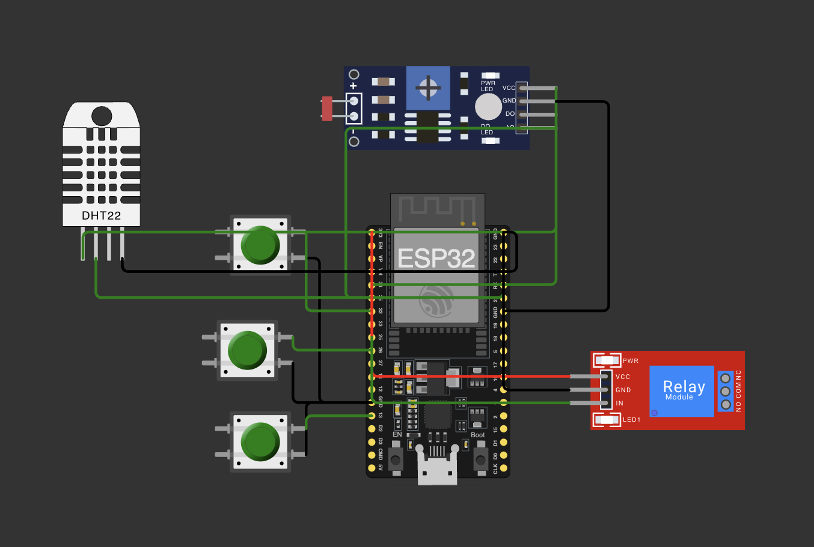

# FIAP - Faculdade de Informática e Administração Paulista

<p align="center">
  <a href="https://www.fiap.com.br/">
    
  </a>
</p>

<br>

# FarmTech Solutions – Fase 2 Cap 1: Sistema de Irrigação Automatizado Inteligente

## Nome do grupo
**AgroTech (GRUPO 61)**

## 👨‍🎓 Integrantes
- <a>Roberto Ferreira - RM561131</a>
- <a>Jacqueline Nanami - RM568498</a>
- <a>Davis Roberto - RM567941</a>
- <a>Guilherme Chan - RM567722</a>

---

## 📜 Descrição

Este projeto implementa, no **ESP32** via **Wokwi**, um **sistema de irrigação inteligente** voltado para o cultivo de **morango**, uma cultura altamente sensível à variação de **umidade** e **pH** do solo.  

O sistema monitora os seguintes parâmetros:
- **NPK** (Nitrogênio, Fósforo e Potássio) — simulados com **3 botões** que indicam apenas a presença ou ausência de cada nutriente.
- **pH do solo** — simulado por um **LDR (Light Dependent Resistor)**, com valores convertidos para a faixa de **0 a 14**.
- **Umidade** — lida por um **DHT22** (umidade do ar simulando a umidade do solo).
- **Irrigação** — controlada por um **módulo de relé** que representa uma bomba d’água real.

A bomba é **ligada automaticamente** quando:
- A **umidade está abaixo de 60%**, ou  
- O **pH sai da faixa ideal de 5.5 a 6.5**.  

Os botões NPK servem apenas como **indicadores visuais**, sem interferir diretamente na irrigação.  
Quando as condições voltam ao ideal, o sistema **desliga a bomba automaticamente**, otimizando o uso de água.



---

## 📁 Estrutura de pastas

- **.github/**: configurações do GitHub (actions, templates).  
- **assets/**: imagens e mídias do repositório (ex.: `esp32-circuito.png`, logos).  
- **config/**: arquivos de configuração (ex.: `libraries.txt` com `DHT sensor library`).  
- **src/**: código-fonte do projeto.  
  - `fase2-irrigacao/esp32-http-server.ino`  
  - `fase2-irrigacao/diagram.json`  

---

## 🔧 Como executar o código

### Opção A — Wokwi (recomendado)
1. Abra o projeto no Wokwi:  
   - **Link do projeto:** https://wokwi.com/projects/320964045035274834  
2. Confirme a pinagem (exemplo):
   - **Botões (N, P, K)** → GPIO **32**, **26**, **13** (com `INPUT_PULLUP` e outra perna em **GND**).  
   - **LDR (AO)** → GPIO **34** (pino ADC). **VCC → 3V3**, **GND → GND**.  
   - **DHT22** → **VCC → 3V3**, **DATA → GPIO 23**, **GND → GND**.  
   - **Relé (IN)** → **GPIO 25**, **VCC → 3V3**, **GND → GND** (**ativo em HIGH** — LED acende quando a bomba está ligada).  
3. No arquivo `config/libraries.txt`, inclua:  
   ```
   DHT sensor library
   ```  
4. Clique em **Run ▶︎**.  
5. Use o **Serial Monitor** para observar NPK/pH/Umidade e o status da bomba.

### Opção B — Arduino IDE (local)
1. Instale o **core do ESP32** (Boards Manager → “esp32”).  
2. Instale a biblioteca **“DHT sensor library”** (Adafruit).  
3. Selecione a placa **“ESP32 Dev Module”**.  
4. Abra o `.ino` em `src/fase2-irrigacao/` e faça o upload.

---

## 🔬 Lógica (resumo)
- **Liga a bomba** quando:
  - `umidade < 60%`, **ou**
  - `pH < 5.5` **ou** `pH > 6.5`
- **Desliga** quando todos os parâmetros voltam ao ideal.  
- Botões NPK são apenas indicadores (não alteram a irrigação).  

> Os valores de referência podem ser ajustados para diferentes culturas, por exemplo:  
> **Morango:** pH 5.5–6.5, umidade acima de 60%.

---

## 🗃 Histórico de lançamentos
* 0.1.0 - 10/2025  
  * Primeira versão do sistema de irrigação (pH + Umidade + Relé) e README revisado.

---

## 📋 Licença


<p>
<a property="dct:title" rel="cc:attributionURL" href="https://github.com/agodoi/template">MODELO GIT FIAP</a>
por <a rel="cc:attributionURL dct:creator" property="cc:attributionName" href="https://fiap.com.br">FIAP</a>
está licenciado sob <a href="http://creativecommons.org/licenses/by/4.0/?ref=chooser-v1" target="_blank" rel="license noopener noreferrer">Attribution 4.0 International</a>.
</p>
